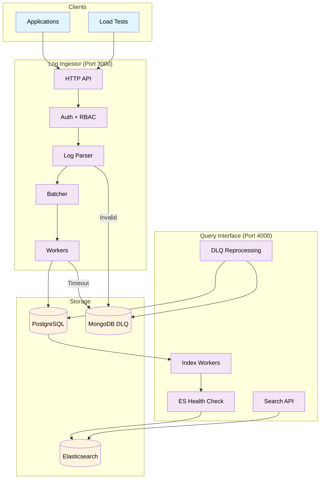

# Logito - Log Management System

A high-performance log ingestion platform with optimized throughput and reliability, built with Go and React.

## System Design



## How It Works

### 1. **Log Ingestion Flow**
```
Client Request → Auth/RBAC → Parser → Batcher → Workers → PostgreSQL
                     ↓                    ↓
                Invalid Logs → DLQ    Timeout Batches → DLQ
```

### 2. **Search Flow**
```
Search Request → Auth/RBAC → Elasticsearch → Results
```

### 3. **Indexing Flow**
```
PostgreSQL → Index Workers → ES Health Check → Elasticsearch
```

### 4. **DLQ Reprocessing Flow**
```
Query Interface → DLQ Reprocessing → PostgreSQL
```

## Key Components

| Component | Purpose | Configuration |
|-----------|---------|---------------|
| **Batcher** | Groups logs for efficiency | Configurable batch size and flush interval |
| **Workers** | Process batches concurrently | Multiple workers with retry logic and timeout handling |
| **Index Workers** | Sync PostgreSQL → Elasticsearch | Multiple workers with batch processing |
| **DLQ Reprocessing** | Re-add failed messages to PostgreSQL | Manual reprocessing via Query Interface |
| **Connection Pools** | Manage database connections | Optimized connection pooling |
| **DLQ** | Store failed messages | MongoDB with monitoring |

## Performance Results

The system demonstrates excellent performance across various load scenarios with consistent reliability and low latency.

## Technology Stack

### Backend Services
- **Go + Gin Framework**: High-performance HTTP server
- **PostgreSQL**: Primary database for log storage
- **Elasticsearch**: Search and indexing engine
- **MongoDB**: Dead Letter Queue (DLQ) for failed messages

### Frontend
- **React + TypeScript**: Modern web interface
- **Tailwind CSS**: Styling and UI components
- **Vite**: Build tool and development server

### Infrastructure
- **Docker Compose**: Container orchestration
- **Make**: Build automation and convenience commands

## Performance Optimizations

### Memory Management
- **GC Tuning**: Optimized garbage collection settings
- **Object Pools**: Reuse memory to reduce allocations
- **Batch Processing**: Group operations for efficiency

### Concurrency
- **Multiple Workers**: Process batches in parallel
- **Index Workers**: Sync data to Elasticsearch
- **Connection Pooling**: Optimized database connections

### Health Monitoring
- **ES Health Check**: Prevents overload with configurable thresholds
- **DLQ Monitoring**: Alerts on failed message accumulation
- **Real-time Metrics**: Throughput, latency, error rates

## Security Features

- **JWT Authentication**: Secure API access
- **RBAC**: Role-based permissions (admin/operator/viewer)
- **Input Validation**: Prevent injection attacks
- **DLQ Protection**: Secure failed message storage

## Quick Start

### Prerequisites
- Docker 20.10+ with Docker Compose 2.0+
- Make (optional, for convenience commands)
- 8GB RAM minimum (16GB recommended)
- 4 CPU cores minimum (8 cores recommended)

### Installation
```bash
# Clone and setup
git clone <repository-url>
cd Logito

# Start all services
make up

# Verify installation
make health

# Access the web interface
open http://localhost:3030
```

## Documentation

- **[API Documentation](docs/api.md)** - Complete API reference with examples
- **[Configuration Guide](docs/configuration.md)** - System configuration and tuning

## Default Specifications

The system is configured with these default specifications:

| Service | CPU | Memory | Purpose |
|---------|-----|--------|---------|
| PostgreSQL | 2.0 cores | 2GB | Database operations |
| Elasticsearch | 2.0 cores | 2GB | Search and indexing |
| Log Ingestor | 1.0 cores | 512MB | High-throughput ingestion |
| Query Interface | 1.0 cores | 512MB | API and indexing |
| Frontend | 0.5 cores | 512MB | Web interface |

**Total Requirements**: 6.5 cores, 5.5GB RAM

⚠️ **Note**: Changing resource specifications requires additional tuning in configuration files. See [Configuration Guide](docs/configuration.md) for details.

## Make Commands

| Command | Description |
|---------|-------------|
| `make up` | Start all services |
| `make down` | Stop all services |
| `make restart` | Restart all services |
| `make logs` | View all service logs |
| `make health` | Check service health |
| `make load` | Run load tests |
| `make reset` | Reset database and run migrations |


## Usage

### Ingest Logs
```bash
curl -X POST http://localhost:3000/logs \
  -H "Content-Type: application/json" \
  -d '{
    "level": "info",
    "message": "Sample log message",
    "resourceId": "server-001",
    "timestamp": "2024-01-01T12:00:00Z",
    "traceId": "trace-123",
    "spanId": "span-456",
    "commit": "abc123",
    "metadata": {
      "parentResourceId": "parent-789"
    }
  }'
```

### Query Logs
```bash
curl "http://localhost:4000/logs?level=error&limit=10"
```

### Run Load Tests
```bash
make load
```

## Development

### Building from Source
```bash
docker compose build
```

### Running Load Tests
```bash
make load
```

## Cleanup

```bash
make down          # Stop services
make clean         # Remove containers and volumes
```

