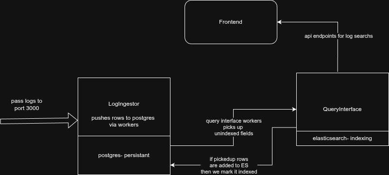

# Logito - Log Management System

A log management system built with Go and React, featuring high-performance log ingestion, Elasticsearch indexing, and a modern web interface.

## Architecture



- **Log Ingestor**: High-throughput log ingestion service (Go)
- **Query Interface**: REST API for log queries and Elasticsearch indexing (Go)
- **Frontend**: Modern React-based web interface
- **PostgreSQL**: Primary database for log storage
- **Elasticsearch**: Search and indexing engine

## Quick Start

```bash
# Clone and start
git clone <repository-url>
cd Logito
make up

# Access the web interface
open http://localhost:3030
```

## Documentation

- **[Installation Guide](docs/installation.md)** - Setup and deployment instructions
- **[Configuration Guide](docs/configuration.md)** - System configuration and tuning
- **[Services Overview](docs/services.md)** - Architecture and service details

## Default Specifications

The system is configured with these default specifications:

| Service | CPU | Memory | Purpose |
|---------|-----|--------|---------|
| PostgreSQL | 2.0 cores | 2GB | Database operations |
| Elasticsearch | 2.0 cores | 2GB | Search and indexing |
| Log Ingestor | 1.0 cores | 512MB | High-throughput ingestion |
| Query Interface | 1.0 cores | 512MB | API and indexing |
| Frontend | 0.5 cores | 512MB | Web interface |

**Total Requirements**: 6.5 cores, 5.5GB RAM

⚠️ **Note**: Changing resource specifications requires additional tuning in configuration files. See [Configuration Guide](docs/configuration.md) for details.

## Make Commands

| Command | Description |
|---------|-------------|
| `make up` | Start all services |
| `make down` | Stop all services |
| `make restart` | Restart all services |
| `make logs` | View all service logs |
| `make health` | Check service health |
| `make mock` | Run load tests |
| `make reset` | Reset database and run migrations |

## Service Endpoints

| Service | URL | Description |
|---------|-----|-------------|
| Frontend | http://localhost:3030 | Web interface |
| Query API | http://localhost:4000 | REST API |
| Log Ingestor | http://localhost:3000 | Log ingestion |
| PostgreSQL | localhost:5433 | Database |
| Elasticsearch | http://localhost:9200 | Search engine |

## Usage

### Ingest Logs
```bash
curl -X POST http://localhost:3000/logs \
  -H "Content-Type: application/json" \
  -d '{
    "level": "info",
    "message": "Sample log message",
    "resourceId": "server-001",
    "timestamp": "2024-01-01T12:00:00Z",
    "traceId": "trace-123",
    "spanId": "span-456",
    "commit": "abc123",
    "metadata": {
      "parentResourceId": "parent-789"
    }
  }'
```

### Query Logs
```bash
curl "http://localhost:4000/logs?level=error&limit=10"
```

### Run Load Tests
```bash
make mock
```

## Development

### Building from Source
```bash
docker compose build
```

### Adding Mock Data
```bash
make mock
```

## Cleanup

```bash
make down          # Stop services
make clean         # Remove containers and volumes
```

